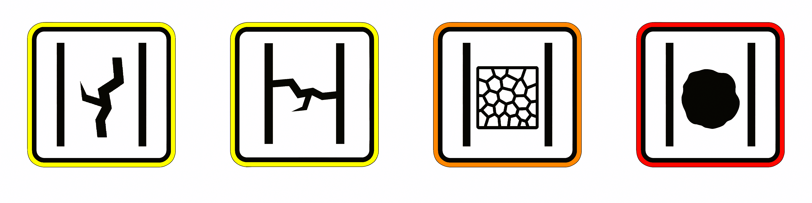

<h2 align="center">🛣️ Fix My Road: Detección inteligente de daños en carreteras 🛣️</h2>

  

---

## 📌 Descripción

**Fix My Road** es una solución de visión por computador que permite detectar automáticamente daños en el asfalto (grietas longitudinales, grietas transversales, grietas de cocodrilo y baches) a partir de imágenes o vídeos capturados desde un smartphone. Utiliza modelos avanzados de detección como **YOLOv8**, desplegados en la nube mediante **Google Cloud Run**.

## 🚀 Tecnologías utilizadas

- 🔍 **YOLOv8** – Detección de objetos en tiempo real
- 🐍 **Python 3.10**
- ☁️ **Google Cloud Platform** (Cloud Run, Cloud Storage, Cloud Functions)
- 🔧 **Flask** – Backend API
- 🌐 **HTML/CSS/JS** – Frontend ligero
- 📦 **Docker** – Contenedorización y despliegue
- 📊 **PostgreSQL** – Base de datos estructurada (opcional)
- 📤 **Firebase Authentication** – Login con cuenta Google
- 🗺️ **Google Maps API** – Visualización geolocalizada de los daños

## 🧠 Cómo funciona

1. El usuario accede a la web y se autentica con su cuenta Google.
2. Sube un vídeo de la carretera capturado desde el móvil.
3. El sistema lo procesa automáticamente con un modelo YOLO en la nube.
4. Se detectan los daños, se clasifican y se guardan en la base de datos.
5. El resultado se muestra en un mapa interactivo.

## 🧾 Tipos de daños detectados

  

Fix My Road es capaz de identificar distintos tipos de daños frecuentes en el pavimento:
- 🟧 **Grieta longitudinal**: Falla paralela al eje de la carretera.
- 🟧 **Grieta transversal**: Perpendicular al eje de circulación.
- 🟨 **Grieta de cocodrilo**: Patrón ramificado, síntoma de fatiga estructural.
- 🟥 **Bache**: Pérdida de material que puede afectar la seguridad vial.
